# Docker Lab 1

Hands-on Docker lab completed as part of the **Digital Egypt Pioneers Initiative (DEPI)**.

This lab focuses on Docker fundamentals and practical containerization workflows, including container lifecycle management, interactive containers, environment variables, bind mounts, Nginx, Dockerfile best practices, non-root users, multi-stage builds, and Docker Hub.

---

## 📌 Learning Objectives

By completing this lab, I practiced:

* Managing Docker containers and images
* Understanding the container lifecycle
* Running containers interactively
* Executing commands inside running containers
* Understanding container filesystem persistence
* Using environment variables with containers
* Using bind mounts for static files
* Serving static content with Nginx
* Creating images from containers with `docker commit`
* Containerizing a Python Flask application
* Using `requirements.txt` for Python dependencies
* Running containers as a non-root user
* Improving Docker build caching
* Creating multi-stage Docker builds
* Tagging and pushing images to Docker Hub

---

# 🧠 Docker Concepts

## CMD vs ENTRYPOINT

| CMD                                      | ENTRYPOINT                                                    |
| ---------------------------------------- | ------------------------------------------------------------- |
| Defines the default command or arguments | Defines the main executable of the container                  |
| Can be easily overridden at runtime      | Usually remains fixed while runtime arguments can be appended |
| Example: `CMD ["python", "app.py"]`      | Example: `ENTRYPOINT ["python"]`                              |

A common combination is:

```dockerfile
ENTRYPOINT ["python"]
CMD ["app.py"]
```

This results in:

```text
python app.py
```

If another argument is provided at runtime, the `CMD` can be replaced while the `ENTRYPOINT` remains.

---

## COPY vs ADD

Both instructions can copy files into a Docker image.

### COPY

`COPY` is the preferred choice for normal file and directory copying:

```dockerfile
COPY app.py /app/
```

### ADD

`ADD` provides additional behavior, such as handling local tar archives.

For predictable Dockerfiles, `COPY` is generally preferred unless the additional functionality of `ADD` is specifically required.

---

# 🧪 Problem 1 — Docker Container Lifecycle

## Objective

* Run the `hello-world` container
* Check the container status
* Start the stopped container
* Remove the container
* Remove the image

## Run the Container

```bash
docker run --name cont1 hello-world
```

The `hello-world` image was automatically pulled from Docker Hub because it was not available locally.

## Check Container Status

Check running containers:

```bash
docker ps
```

Since `hello-world` finishes after displaying its message, the container is no longer running.

To display stopped containers:

```bash
docker ps -a
```

The container appears with:

```text
Exited (0)
```

This means the process inside the container completed successfully.

## Start the Stopped Container

```bash
docker start cont1
```

The container can be started again because its container definition still exists.

## Remove the Container

```bash
docker rm -f cont1
```

## Remove the Image

Check available images:

```bash
docker image ls
```

Remove the `hello-world` image:

```bash
docker rmi hello-world
```

## Result

The `hello-world` container was successfully:

1. Created and executed
2. Checked using `docker ps` and `docker ps -a`
3. Started again
4. Removed
5. Followed by removal of its Docker image

### Evidence


---

# 🧪 Problem 2 — Interactive Container and Container Filesystem

## Objective

* Run an Ubuntu container
* Execute `echo docker`
* Open a Bash shell inside the container
* Create a file named `hello-docker`
* Stop and remove the container
* Observe what happens to the file

## Run the Ubuntu Container

```bash
docker run -it -d --name problem-2 ubuntu
```

Check the running container:

```bash
docker ps
```

## Open a Bash Shell

```bash
docker exec -it problem-2 bash
```

Inside the container, execute:

```bash
echo docker
```

Create the required file:

```bash
touch hello-docker
```

Verify that the file exists:

```bash
ls
```

The `hello-docker` file appears inside the container filesystem.

Exit the shell:

```bash
exit
```

## Stop and Remove the Container

```bash
docker stop problem-2
```

Check the container status:

```bash
docker ps -a
```

The container appears as stopped.

Remove it:

```bash
docker rm -f problem-2
```

## Observation

The `hello-docker` file was created inside the container's writable filesystem layer.

Because the file was **not stored in a Docker volume or bind mount**, removing the container also removed the file.

This demonstrates an important Docker concept:

```text
Container Writable Layer
          ↓
     Container Removed
          ↓
      Data Removed
```

For persistent data, Docker **volumes** or **bind mounts** should be used.

### Evidence

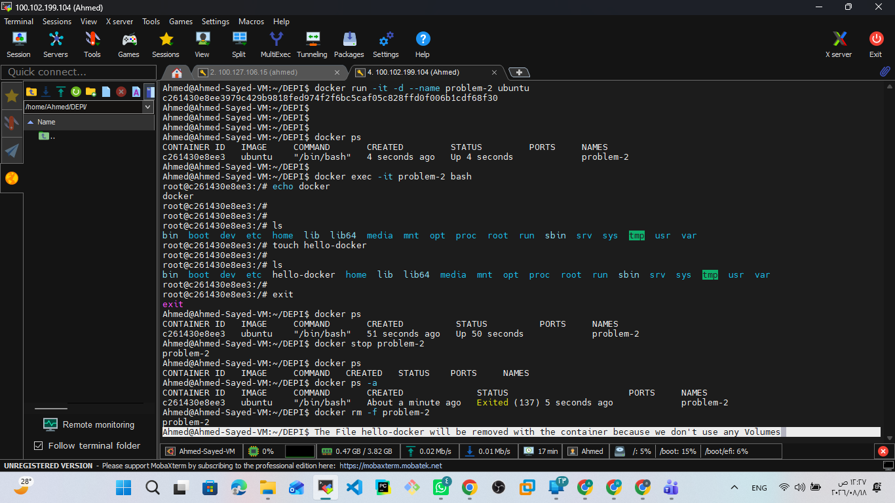

---

# 🧪 Problem 3 — MySQL Container

## Objective

Deploy a MySQL database container with:

* Image: `mysql:latest`
* Container name: `app-database`
* Root password configured using `MYSQL_ROOT_PASSWORD`
* Background execution

## Run MySQL

```bash
docker run -d \
  --name app-database \
  -e MYSQL_ROOT_PASSWORD='P4sSw0rd0!' \
  mysql:latest
```

### Explanation

* `-d` runs the container in detached/background mode.
* `--name app-database` assigns the required container name.
* `-e MYSQL_ROOT_PASSWORD=...` sets the MySQL root password using an environment variable.
* `mysql:latest` specifies the MySQL image.

## Check the Container

```bash
docker ps
```

The container appears as:

```text
app-database
mysql:latest
Up
```

## Check MySQL Logs

```bash
docker logs app-database
```

The logs show the MySQL initialization process and indicate that the MySQL server became ready for connections.

### Evidence

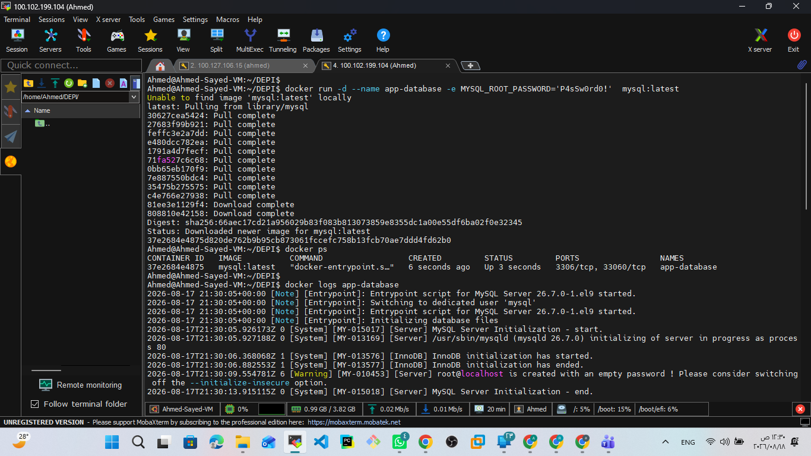

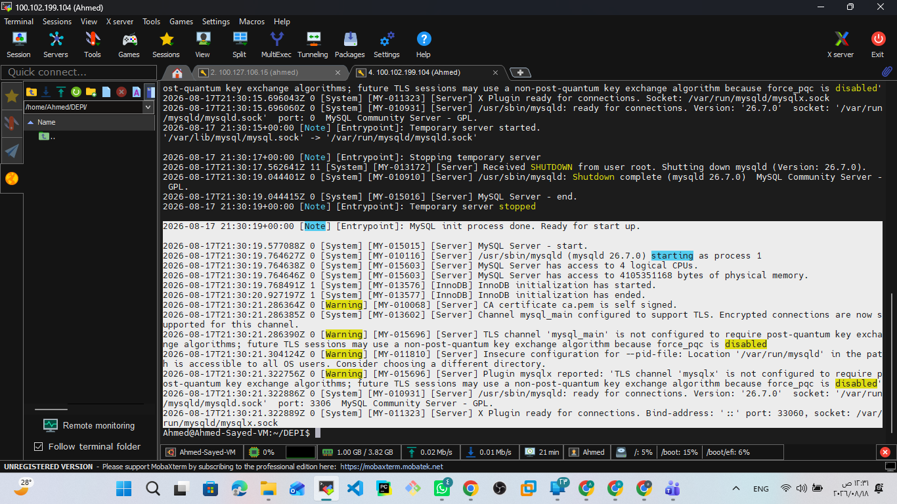

---

# 🧪 Problem 4 — Nginx, Bind Mount, and Docker Commit

## Objective

* Run an Nginx container
* Add static HTML files
* Use a bind mount to connect host files to the container
* Modify the HTML file from the host
* Verify the content through the browser
* Commit the container as a new Docker image

---

## Create the Host Directory

```bash
mkdir nginx-html
```

This directory will contain the static HTML files on the host machine.

---

## Run Nginx with a Bind Mount

```bash
docker run -d \
  --name my-nginx \
  -p 8080:80 \
  -v ./nginx-html:/usr/share/nginx/html \
  nginx:latest
```

The bind mount connects:

```text
Host
./nginx-html
      │
      │ Bind Mount
      ▼
Container
/usr/share/nginx/html
```

### Explanation

The `-v` option mounts the host directory:

```text
./nginx-html
```

to the Nginx document root:

```text
/usr/share/nginx/html
```

This means that files created or modified on the host are immediately available to Nginx inside the container.

---

## Initial Result

Because the mounted directory did not initially contain an `index.html`, Nginx returned:

```text
403 Forbidden
```

This happened because Nginx had no index page to serve from the mounted directory.

---

## Create the HTML File on the Host

```bash
echo "<h1>Hello from Host</h1>" >> ./nginx-html/index.html
```

The HTML file was created **on the host**, not inside the container.

Because of the bind mount, Nginx could access the file immediately.

---

## Test the Website

Open:

```text
http://<server-ip>:8080
```

The browser displayed:

```text
Hello from Host
```

This confirms that the bind mount was working correctly.

### Bind Mount Workflow

```text
Host HTML File
      │
      ▼
./nginx-html/index.html
      │
      │ Bind Mount
      ▼
/usr/share/nginx/html/index.html
      │
      ▼
Nginx Container
      │
      ▼
Browser
```

---

## Commit the Container

After verifying the Nginx container:

```bash
docker commit my-nginx nginx-custom
```

This creates a new Docker image from the current state of the container.

Check the images:

```bash
docker images
```

The new image appears as:

```text
nginx-custom
```

### Important Note

The bind-mounted host files are not stored inside the image by `docker commit`.

The commit creates an image from the container's filesystem, while the bind-mounted files remain managed by the host filesystem.

### Evidence

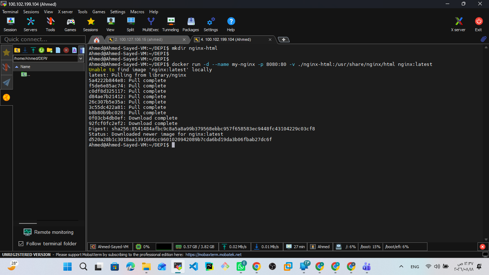

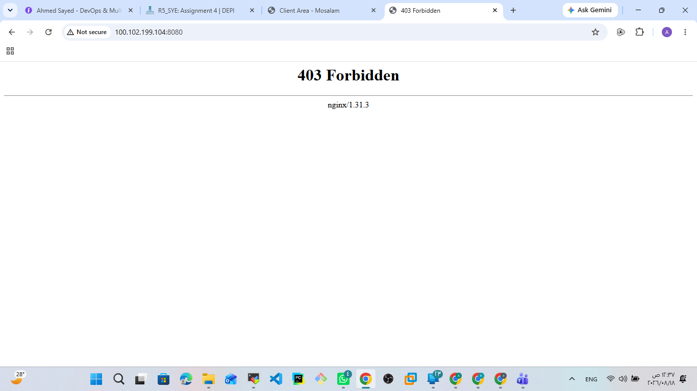

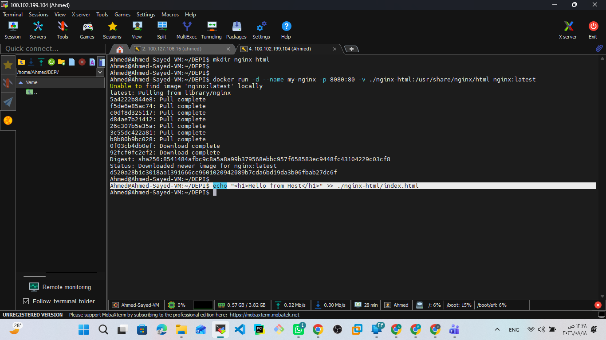

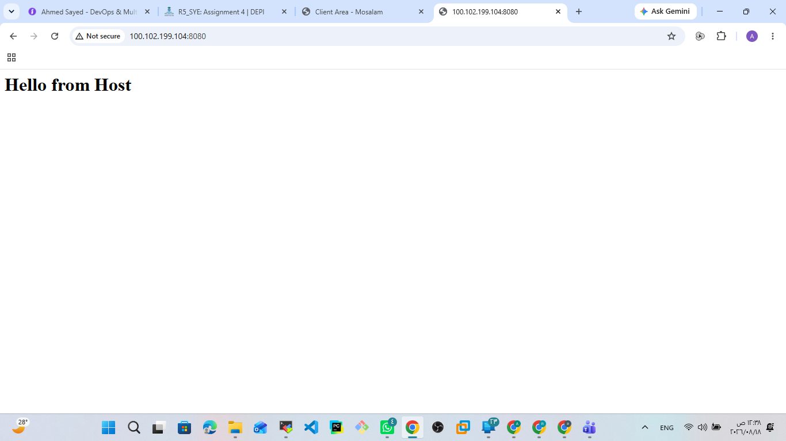

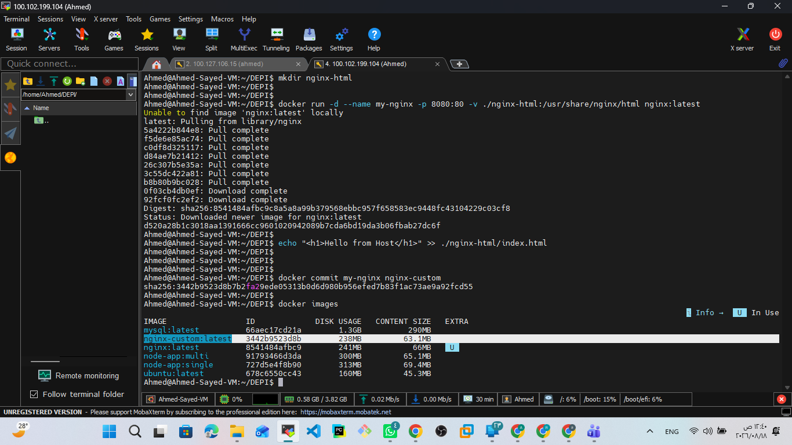

---

# 🧪 Problem 5 — Python Flask Application

## Objective

* Create a simple Python application
* Create a Dockerfile
* Build and test the application
* Use `requirements.txt`
* Run the application as a non-root user
* Create a multi-stage Dockerfile
* Compare image sizes
* Push the created image to Docker Hub

---

## Application

The application is a simple Flask application that uses Redis to maintain a visit counter.

The application connects to Redis using the Docker service/container name:

```python
cache = redis.Redis(host='redis', port=6379)
```

Required Python dependencies:

```text
Flask
redis
```

---

# 🐍 Single-Stage Dockerfile

The first Dockerfile uses:

```dockerfile
FROM python:3.9-slim
```

The Dockerfile was designed with Docker build caching and security in mind.

```dockerfile
FROM python:3.9-slim

WORKDIR /app

RUN groupadd -r appgroup && useradd -r -g appgroup appuser

COPY requirements.txt .

RUN pip install --no-cache-dir -r requirements.txt

COPY app.py .

RUN chown -R appuser:appgroup /app

USER appuser

EXPOSE 5000

ENV FLASK_APP=app.py
ENV FLASK_RUN_HOST=0.0.0.0

CMD ["flask", "run"]
```

---

## Why Copy `requirements.txt` First?

The Dockerfile uses:

```dockerfile
COPY requirements.txt .

RUN pip install --no-cache-dir -r requirements.txt

COPY app.py .
```

instead of copying everything at once.

This improves Docker layer caching.

If only `app.py` changes, Docker can reuse the dependency installation layer instead of executing:

```bash
pip install
```

again.

The basic idea is:

```text
requirements.txt
       ↓
Install Dependencies
       ↓
Cached Layer
       ↓
app.py
       ↓
Application Layer
```

If `app.py` changes:

```text
Dependency Layer → Reused
Application Layer → Rebuilt
```

---

# 🔐 Non-Root User

The image creates a dedicated group and user:

```dockerfile
RUN groupadd -r appgroup && useradd -r -g appgroup appuser
```

The application directory ownership is then updated:

```dockerfile
RUN chown -R appuser:appgroup /app
```

Finally, the container switches from root to the application user:

```dockerfile
USER appuser
```

This follows the security principle of running application processes with the minimum privileges required.

Instead of:

```text
Container
   ↓
root
```

the application runs as:

```text
Container
   ↓
appuser
```

---

## Build the Single-Stage Image

```bash
docker build -t single-stage-python-app:v1 .
```

The image was built successfully.

---

# 🚀 Multi-Stage Dockerfile

The bonus task was implemented using a multi-stage Docker build.

The main idea is to separate dependency preparation from the final runtime image.

---

## Builder Stage

```dockerfile
FROM python:3.9-slim AS builder

WORKDIR /app

COPY requirements.txt .

RUN pip install --no-cache-dir --prefix=/install -r requirements.txt
```

The builder stage installs the required Python dependencies into:

```text
/install
```

---

## Final Stage

```dockerfile
FROM python:3.9-slim

WORKDIR /app

RUN groupadd -r appgroup && useradd -r -g appgroup appuser

COPY --from=builder /install /usr/local

COPY app.py .

RUN chown -R appuser:appgroup /app

USER appuser

EXPOSE 5000

CMD ["python", "app.py"]
```

The final stage receives the installed dependencies using:

```dockerfile
COPY --from=builder /install /usr/local
```

It then copies only the application source required to run the service.

---

## Multi-Stage Build Flow

```text
              Builder Stage
                   │
            requirements.txt
                   │
                   ▼
              pip install
                   │
                   ▼
                /install
                   │
                   │ COPY --from=builder
                   ▼
               Final Stage
                   │
          ┌────────┴────────┐
          │                 │
      Dependencies        app.py
          │                 │
          └────────┬────────┘
                   ▼
              appuser
                   │
                   ▼
             Python App
```

---

## Build the Multi-Stage Image

```bash
docker build -t multi-stage-python-app:v1 .
```

The multi-stage image was successfully built.

---

# 📊 Image Size Comparison

The generated images were compared using:

```bash
docker images | grep python-app:v1
```

Observed result:

| Image                        | Content Size |
| ---------------------------- | -----------: |
| `single-stage-python-app:v1` |     ~49.6 MB |
| `multi-stage-python-app:v1`  |       ~47 MB |

The difference in this specific application is relatively small because the application is lightweight and both stages use the `python:3.9-slim` base image.

The main benefit demonstrated here is the separation between the dependency/build stage and the final runtime stage.

---

# 🐳 Docker Hub

The multi-stage image was tagged for Docker Hub:

```bash
docker tag multi-stage-python-app:v1 \
a7medsayed/depi-docker-python-lab1:v1
```

Then the image was pushed:

```bash
docker push a7medsayed/depi-docker-python-lab1:v1
```

The push completed successfully.

## Docker Hub Repository

```text
a7medsayed/depi-docker-python-lab1
```

Tag:

```text
v1
```

The Docker Hub repository and `v1` tag were verified successfully.

### Evidence

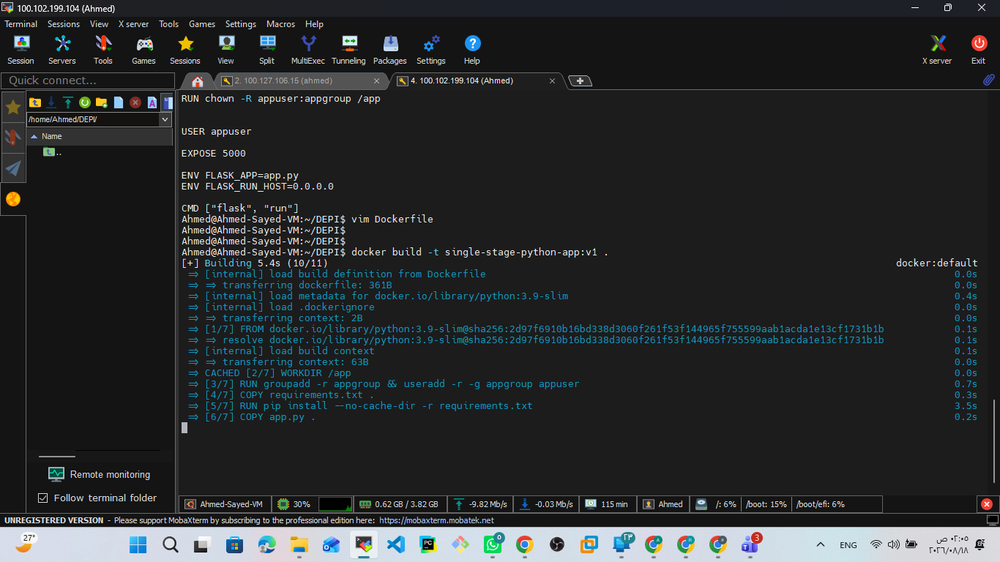

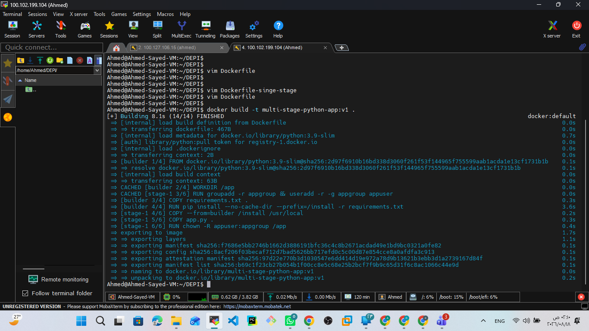

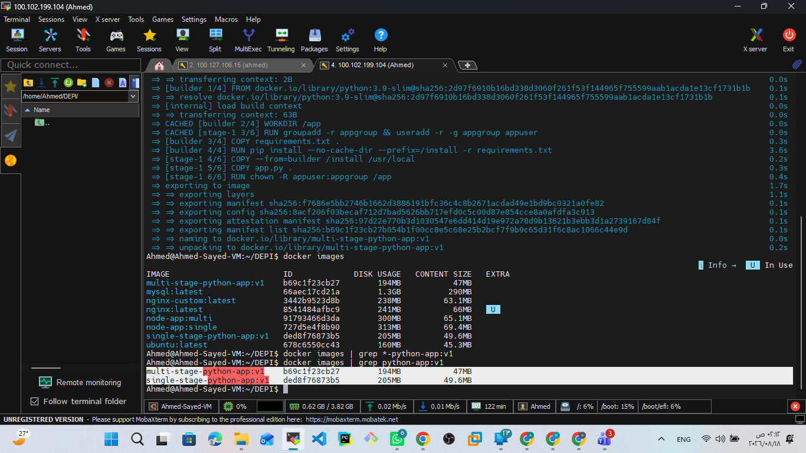

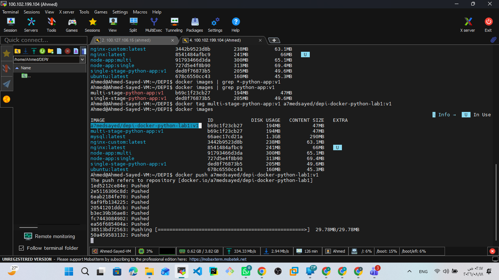

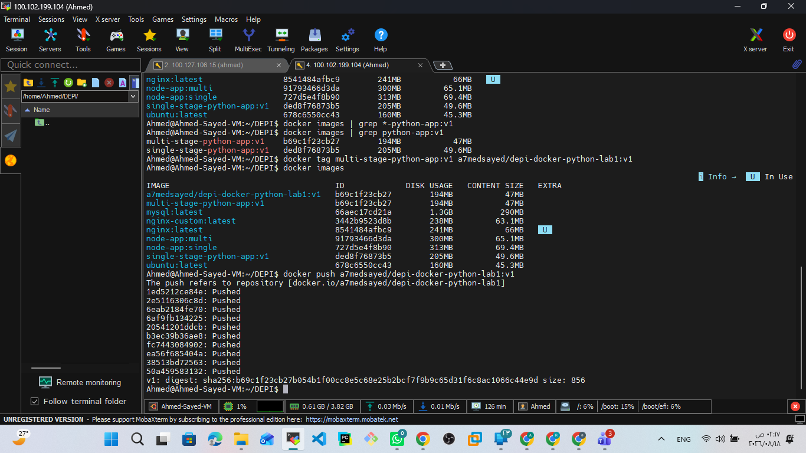

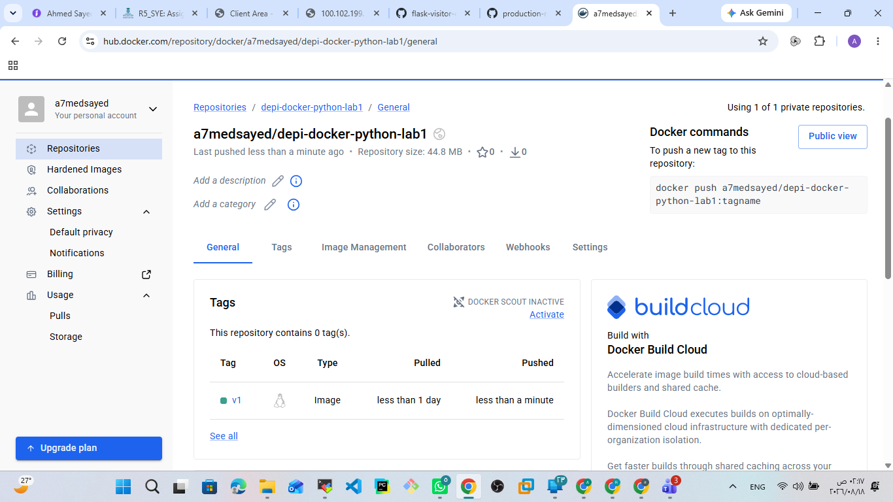


---

# 📚 Key Takeaways

This lab provided practical experience with the complete Docker workflow:

```text
Docker Image
     │
     ▼
docker run
     │
     ▼
Container
     │
     ├── docker exec
     ├── docker stop
     ├── docker start
     └── docker rm
```

The lab also covered:

* Docker image and container lifecycle
* Interactive containers
* Container filesystem behavior
* Environment variables
* Bind mounts
* Nginx static content
* Docker image creation using `docker commit`
* Python application containerization
* Dependency management using `requirements.txt`
* Docker layer caching
* Non-root containers
* Multi-stage Docker builds
* Image tagging
* Docker Hub publishing

---

# 🛠️ Technologies Used

* Docker
* Docker Hub
* Python 3.9
* Flask
* Redis
* Nginx
* MySQL
* Ubuntu
* Linux

---

# 👨‍💻 Author

**Ahmed Sayed**

DevOps & Multi-Cloud Engineer
